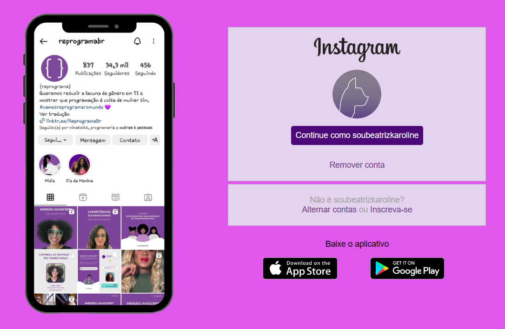

 
  Recriando a interface de login do Instagram com CSS e HTML.

- Desafio prático realizado para a Reprograma
- Desafio da turma de Front-End
- Feito a parte

## Alterações
 
 - Alteração no tipo do celular
 1. Modelo
 2. Cor
 3. Tela Fiz alterações no celular ( modelo e fundo)
 
 - Alteração da cor de fundo, de alguns elementos e icones

 - Inclusão de botões da Google Play e Apple Store 

 - Alteração de Foto de Perfil

  

